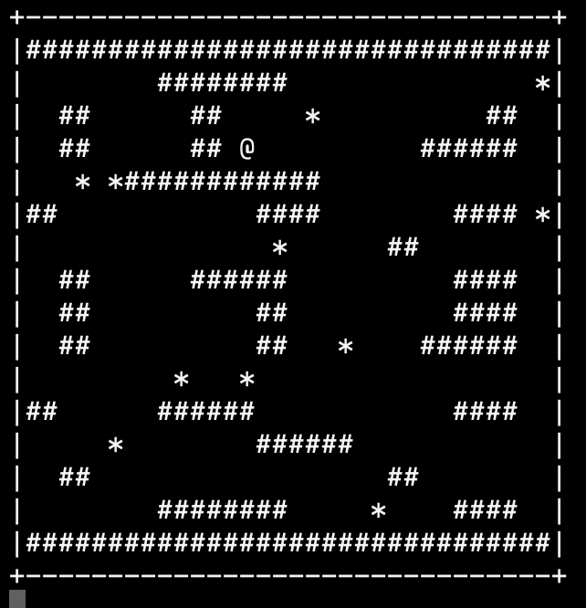

# Snake Game with Python

## Description
This is a simple Snake game implemented in Python. In this game, you control a snake represented by the "@" symbol. You can move the snake using the following keys:
- "W" to move up
- "S" to move down
- "A" to move left
- "D" to move right

The game board consists of "#" symbols representing walls and "*" symbols representing food. The snake grows longer each time it eats food. The game ends when the snake collides with a wall or with itself. You can terminate the game at any time by pressing the "Q" key.

## How to Play
1. Clone this repository to your local machine.
2. Navigate to the directory where you cloned the repository.
3. Run the `snake.py` file using Python.
4. Use the "W", "A", "S", and "D" keys to control the snake.
5. Press "Q" to quit the game.

## Dependencies
This game requires Python to be installed on your system.

## Credits
This Snake game is created by [nicolasanhueza].